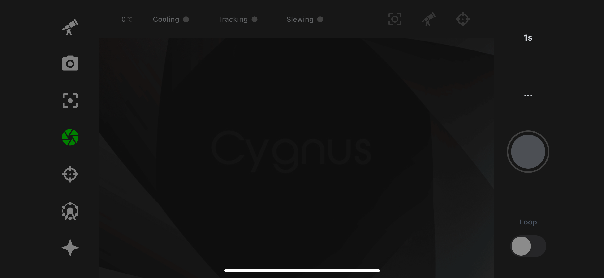
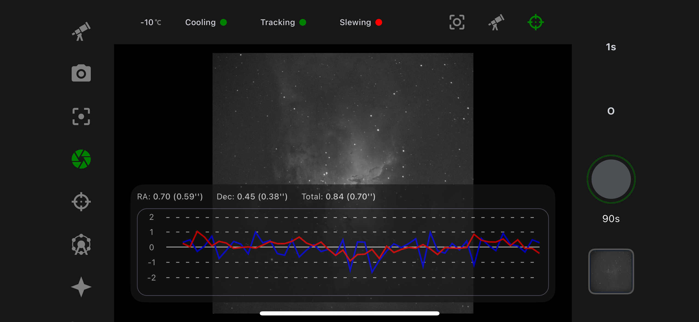
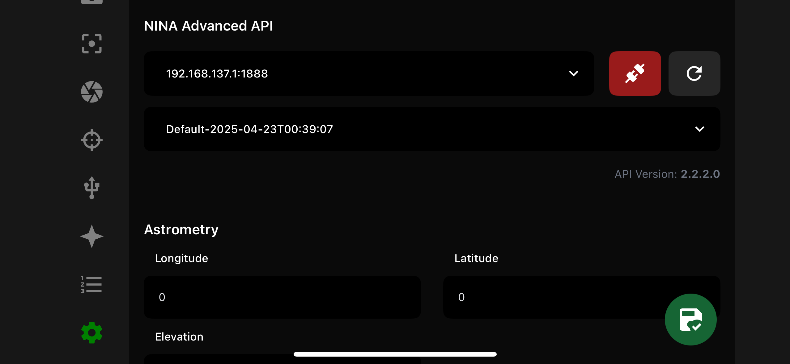
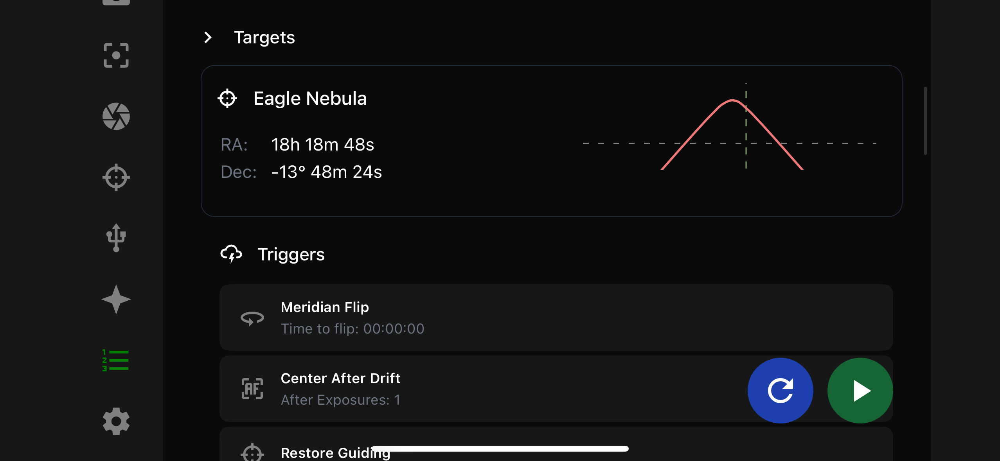

# Cygnus Astro

Mobile interface to Manage N.I.N.A. using the Advanced API plugin.

# Screenshots

## Credits
- [N.I.N.A. Advance API Plugin](https://github.com/christian-photo/ninaAPI)
- [OpenNGC](https://github.com/mattiaverga/OpenNGC)
