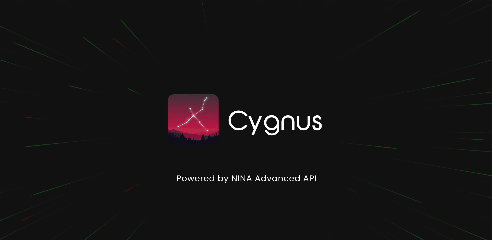

# Cygnus Astro

Mobile interface to Manage NINA using the Advanced API plugin.

# Screenshots

## Credits
- [NINA Advance API Plugin](https://github.com/christian-photo/ninaAPI)
- [OpenNGC](https://github.com/mattiaverga/OpenNGC)
